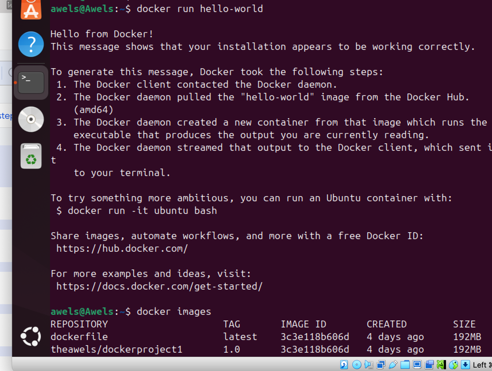

# IntroductionToDoccker
Here I will be submiting my intoduction to Docker project

# PURPOSE AND PROJECT GOALS. 
1. I should be able to grasp the concept of containers, their isolation and their role in packaging applications.
2. familaize myself with key Docker feautures, command and best practices.
3. comprehend how docker containers contribute to resourse efficiency compared to traditional virtual machines. 
4. learn how docker ensures consistent application behaviour accross different development, testing and production enviroments. 
5. master the techniques for quick deploying and scaling applications using Docker.

The first thing to do is to run this command 
"sudo apt update". this is a command that refreshes the package list on a debian-based system this ensures the latest software information is available for installation. the image below delow depicts this 

the next thing to do is to run this command "sudo apt-get install ca-certificates curl gnupg". this command installs essential packages including certificate authorities,  a data transfer tool (curl) and the GNU Privacy Guard for secure communication and package verification. 
the image below depicts this 

The next thing to do is to run the command "sudo install -m 0755 -d /etc/apt/keyrings and this command above creates a directory with specific permissions for storing key ring files, which are used for dockers authentication. 
the image below depicts this 

the next thing to do is 
curl -fsSL https://download.docker.com/linux/ubuntu/gpg | sudo gpg --dearmor -o /etc/apt/keyrings/docker.gpg
this command downloads the Docker GPG Key using curl. the image below depicts that 

the next thing to do is to run this command "echo \
  "deb [arch=$(dpkg --print-architecture) signed-by=/etc/apt/keyrings/docker.gpg] https://download.docker.com/linux/ubuntu \
  $(. /etc/os-release && echo "$VERSION_CODENAME") stable" | \
  sudo tee /etc/apt/sources.list.d/docker.list > /dev/null'

  this echo command creates a docker apt repository configuration entry for the ubuntu system,  incorporating the system architecture and Docker GPG Key and then sudo tee /etc/apt/sources.list.d/docker.list > /dev/null' write the configuration to the /etc/apt/sources.list.d/docker.list file. 

  the image below depicts this. 
  

  the next command is to install the latest version of docker and verify that docker has been successfully installed using the command "sudo apt-get update" and "sudo apt-get install docker-ce docker-ce-cli containerd.io docker-buildx-plugin docker-compose-plugin"

  the image below depicts this

the next thing is to run the command 
"sudo systemctl status docker"
the image below depicts this

the next thing to do is to run the command "sudo usermod -aG docker awels 
this also allows us to run commands now without superuser priviledges. the image below depicts this 

the next thing is to run this command 
docker run hello-world
the image below depicts this 

the next command to run is docker images
the image below depicts this 

i ran the following commands and the images below depicts this 
docker run hello-world 
docker ps
docker ps -a
docker stop
docker pull
docker push 
docker images
docker rmi 

the images below depicts this 

## Initial Problem Encountered
At first, I attempted to remove the image using the basic command:

   docker rmi 3c3e118b606d

However, the command failed with the following error message:

   Error response from daemon: conflict: unable to delete 3c3e118b606d (must be forced) - image is referenced in multiple repositories

This indicated that the image could not be deleted because it was tagged under multiple repositories, such as:
- theawels/dockerproject1:1.0
- theawels/my-nginx:1.0
- theawels/my-nginx:latest

This conflict prevented Docker from proceeding with the image deletion.

First Step Toward Solution: Removing Image Tags
To resolve the tag conflict, I executed the following commands one after another to untag the image from all repositories referencing it:

   docker rmi theawels/dockerproject1:1.0
   docker rmi theawels/my-nginx:1.0
   docker rmi theawels/my-nginx:latest

Each command successfully removed the specific tag pointing to the shared image ID. However, a new error was raised when I retried removing the image:

   Error response from daemon: conflict: unable to delete 3c3e118b606d (must be forced) - image is being used by stopped container 41279e8a6825

   Second Step: Removing Stopped Containers Tied to the Image
At this point, I realized the image was still in use by stopped containers, which must be removed before the image can be deleted.

I listed all containers (including stopped ones) using:

   docker ps -a

From the output, I identified a container with ID 41279e8a6825 using the image. I removed it using:

   docker rm 41279e8a6825

However, on attempting to delete the image again, a new stopped container c5453f2d9ce3 was identified as using the same image. I repeated the same process:

   docker rm c5453f2d9ce3

Final Step: Successfully Removing the Image
After removing all containers that were linked to the image, I ran:

   docker rmi 3c3e118b606d

This time, the command executed successfully, and the image was completely removed from the system.

## Conclusion
The deletion of a Docker image failed initially because:
- It was tagged under multiple repository names
- It was still referenced by stopped containers

Through a methodical cleanup process involving:
1. Untagging all references to the image
2. Identifying and removing all stopped containers using the image

…I was finally able to delete the image.

This exercise reinforced the importance of understanding Docker’s internal dependency checks, and how images and containers are tightly linked. It also taught me how to troubleshoot Docker errors using docker ps -a, docker rm, and proper sequencing of cleanup commands.
